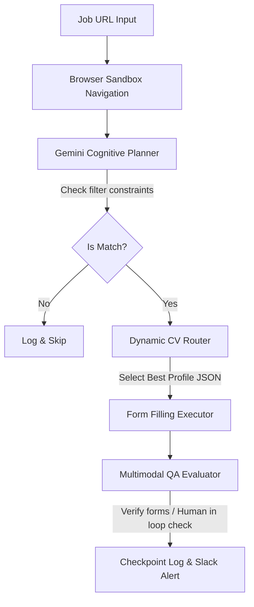

# Gemini Job Application Subagent (GeminiJobBot)

An autonomous, Gemini-driven web agent designed to navigate job portals, filter irrelevant listings, and dynamically submit customized job applications using advanced planning.

Un subagente web autónomo impulsado por Gemini diseñado para navegar portales de empleo, filtrar ofertas irrelevantes y enviar postulaciones personalizadas dinámicamente mediante planeación avanzada.

---

## 🌟 Key Value Proposition / Propuesta de Valor

### English
Traditional automation scripts (using Playwright, Selenium, or Puppeteer alone) are brittle. They break as soon as class names change, require rigid hardcoded logic, and cannot make decisions about whether a job aligns with candidate profile guidelines. 

**GeminiJobBot** introduces a shift towards **Agentic Workflows**:
- **DOM Resilience**: It uses multimodal capabilities (visual screenshots + structured semantic DOM parsing) to locate buttons and text boxes, rendering static selectors obsolete.
- **Dynamic Context Routing**: Selects the target resume format (e.g., *AI Specialist* vs *Backend Developer*) based on a real-time semantic analysis of the job description.
- **Cognitive Filtering**: Evaluates complex constraints (salary ranges, remote-work status, forbidden keyword combinations) instead of simple keyword lookups.

### Español
Los scripts de automatización tradicionales (Playwright, Selenium o Puppeteer independientes) son frágiles. Se rompen tan pronto como cambian los nombres de las clases CSS, requieren lógica rígida cableada y no pueden tomar decisiones sobre si un trabajo coincide con el perfil del candidato.

**GeminiJobBot** propone una transición hacia **Flujos Agénticos**:
- **Resiliencia al DOM**: Utiliza capacidades multimodales (capturas de pantalla visuales + análisis semántico del DOM) para ubicar botones y campos de formulario, haciendo obsoletos los selectores estáticos.
- **Enrutamiento Dinámico de Contexto**: Selecciona el currículum de destino (ej. *Especialista en IA* vs *Desarrollador Backend*) basándose en un análisis semántico en tiempo real de la descripción del puesto.
- **Filtrado Cognitivo**: Evalúa restricciones complejas (rangos salariales, modalidad remota, palabras clave prohibidas) en lugar de búsquedas simples de palabras clave.

---

## 🏗️ Agentic Architecture / Arquitectura Agéntica



1. **User Input / Inputs**: Load job targeting directives and candidate blueprints.
2. **Planner / Planificador**: Gemini reads the raw page layout, determines if details match criteria.
3. **Execution Sandbox / Entorno de Ejecución**: Interacts with form elements using semantic routing.
4. **QA Evaluator / Evaluador de Calidad**: Inspects fields prior to submission.
5. **Checkpoints**: Persists current session state and issues logging metrics.

---

## 📁 Repository Structure / Estructura del Repositorio

```text
├── blueprints/
│   └── candidate_spec.json     # Rules, filters, and dynamic CV routing configuration.
├── profiles/
│   └── resume_template.json    # Structured candidate profile details in JSON.
├── src/
│   └── orchestrator.py         # Python runner implementing the Gemini Agent loop.
├── workflows/
│   └── monitor_config.json     # Telemetry and execution monitoring configurations.
├── .env.example                # Template for environment credentials.
└── README.md                   # Recruiter-oriented project documentation.
```

---

## ⚙️ Installation & Setup / Instalación y Configuración

### 1. Prerequisites / Requisitos
* Python 3.10+
* Playwright (optional, for browser automation rendering)
* Gemini API Key ([Google AI Studio](https://aistudio.google.com/))

### 2. Install Dependencies / Instalar Dependencias
```bash
pip install -r requirements.txt
# or manually install genai sdk:
pip install google-genai python-dotenv
```

### 3. Configure Credentials / Configurar Credenciales
Copy the `.env.example` file and configure your API Keys:
```bash
cp .env.example .env
```
Open `.env` and configure:
```env
GEMINI_API_KEY=your-actual-api-key
GEMINI_MODEL=gemini-2.5-flash
```

### 4. Running the Agent / Ejecutando el Agente
To run the orchestrator in mock evaluation mode:
```bash
python src/orchestrator.py
```

---

## 📊 Recruiter Focus: Core Agentic Highlights
* **Decoupled Configuration**: Candidate spec parameters are fully isolated from logical execution, allowing non-developers to configure targeting schemas.
* **Modern Stack**: Leverages the official, high-performance `google-genai` Python SDK.
* **Human-in-the-Loop Safeguards**: Threshold parameters prevent automatic form submission if AI confidence falls below a configured percentage (e.g., 90%).
