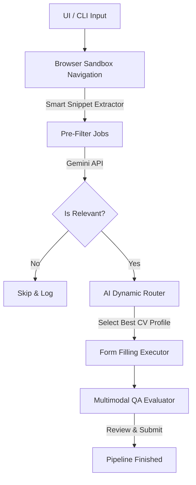

# GeminiJobBot - System Architecture / Arquitectura del Sistema

### English
GeminiJobBot leverages a highly decoupled, agentic architecture to automate job applications. Unlike traditional scrapers that rely on fragile CSS selectors, this bot uses **Multimodal Semantic Parsing** powered by Gemini.

### Español
GeminiJobBot utiliza una arquitectura agéntica altamente desacoplada para automatizar postulaciones de empleo. A diferencia de los scrapers tradicionales que dependen de frágiles selectores CSS, este bot usa **Análisis Semántico Multimodal** impulsado por Gemini.

---

## High-Level Pipeline / Pipeline de Alto Nivel

## Core Components / Componentes Principales

### 1. Browser Sandbox (Playwright)
**English**: The execution engine is handled by `PlaywrightBrowserEngine`. It is responsible for bypassing consent screens (e.g., EU Google Consent), injecting stealth cookies, and executing DOM evaluation scripts to extract `snippets`.
**Español**: El motor de ejecución es gestionado por `PlaywrightBrowserEngine`. Se encarga de evadir pantallas de consentimiento (ej. Consentimiento de Google en la UE), inyectar cookies y ejecutar scripts de evaluación del DOM para extraer `snippets` (resúmenes).

### 2. Cognitive Planner (Gemini) / Planificador Cognitivo
**English**: The brains of the operation, `GeminiJobAgent`, uses the `gemini-2.5-flash` model via the `google-genai` SDK.
- **Pre-Filtering:** Evaluates an array of job snippets simultaneously to reduce rate limiting.
- **Dynamic Routing:** Compares the full job description against multiple CV profiles (e.g., *Frontend*, *Backend*, *QA*) and selects the most optimal resume.
- **Cognitive Filtering:** Analyzes salary ranges, remote-work status, and keyword match percentages.

**Español**: El cerebro de la operación, `GeminiJobAgent`, usa el modelo `gemini-2.5-flash` mediante el SDK `google-genai`.
- **Pre-Filtrado:** Evalúa una serie de resúmenes de empleos simultáneamente para reducir el consumo de la API.
- **Enrutamiento Dinámico:** Compara la descripción completa del empleo con múltiples perfiles de CV y selecciona el más óptimo.
- **Filtrado Cognitivo:** Analyza rangos salariales, teletrabajo y porcentajes de compatibilidad de palabras clave.

### 3. FastAPI Dashboard / Panel FastAPI
**English**: A lightweight backend (`app.py`) serves the frontend and proxies background tasks using Uvicorn and Starlette's `BackgroundTasks`. It features live logging via a polling mechanism and UI state persistence via `localStorage`.
**Español**: Un backend ligero (`app.py`) que sirve el frontend web y delega tareas en segundo plano usando Uvicorn y `BackgroundTasks`. Cuenta con logs en vivo y persistencia de UI mediante `localStorage`.

---

## Tech Stack / Tecnologías
* **Backend:** FastAPI, Uvicorn, Python 3.10+
* **Frontend:** HTML5, CSS3, Vanilla JavaScript
* **AI Engine:** Google GenAI SDK (Gemini Models)
* **Automation:** Playwright (Headless/Headed modes)
* **Parsing:** PyPDF2 (CV extraction), BeautifulSoup4 (DOM text extraction)

---

## Rate Limit Optimization / Optimización de Límite de Peticiones

**English**: To circumvent Gemini Free Tier restrictions (429 errors), the system uses a **Snippet Batching** strategy. Instead of sending one HTTP request per discovered URL, Playwright aggregates job snippets from the search page and evaluates them in a single prompt. Furthermore, the bot incorporates a mathematical **Smart Rate Limit Waiter** that parses "Retry in Xs" directly from the Google API exception and pauses exactly the needed amount of time.
**Español**: Para evitar las restricciones de la capa gratuita de Gemini (errores 429), el sistema usa una estrategia de **Agrupación de Resúmenes** (Snippet Batching). En lugar de enviar una petición HTTP por cada URL descubierta, Playwright agrega los resúmenes de empleos de la página de resultados y los evalúa en una única petición a la IA. Además, incluye un **Espera Inteligente de Límite** que lee matemáticamente el tiempo de espera recomendado por Google ("Retry in Xs") y detiene la ejecución el tiempo exacto.

---

## Execution Workflow / Flujo de Ejecución

1. **CV Processing**: `extract_text_from_pdf` reads all available PDFs in `./profiles/`.
2. **Native Portal Search**: `run_bulk_pipeline` searches for roles directly on LinkedIn and Indeed using custom URL parameters, falling back to Google Search if blocked.
3. **Login Wall Detection**: The orchestrator checks for authentication walls and pauses the automation (`check_login_wall`), prompting the user via UI logs to manually log in if necessary.
4. **Pre-Filtering**: `extract_job_snippets` scrapes search results and sends a batch to Gemini (`pre_filter_jobs`) to discard irrelevant ones based on the `candidate_spec.json`.
